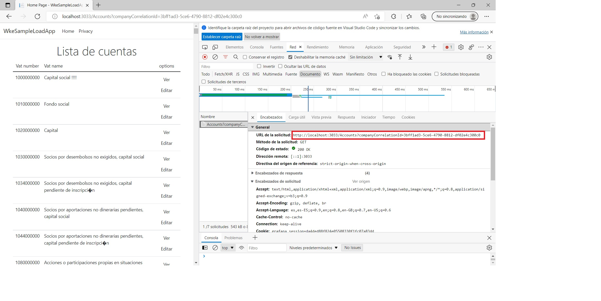
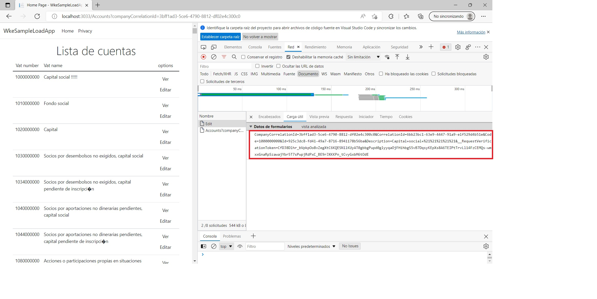

# First Scenario
1. First add these lines in init stage to define the headers and a new import.
```javascript
import { sleep, check } from 'k6';

const accept = 'text/html,application/xhtml+xml,application/xml;q=0.9,image/webp,image/apng,*/*;q=0.8,application/signed-exchange;v=b3;q=0.9';
const acceptEncoding = 'gzip, deflate, br';
const contentType = 'application/x-www-form-urlencoded';
```

2. Using developer tools we will reproduce the calls that it's done by the browser. So we click on **Cuentas** link and copy the Url from *Encabezados*

```javascript
http.get(`${data.baseUrl}/Accounts?companyCorrelationId=3bff1ad3-5ce6-4790-8812-df02e4c300c0`,
        { headers:{'Accept': accept, 'Accept-Encoding': acceptEncoding }});
sleep(2);
```
3. And then click on **Edit** for the first account and we make the same thing
```javascript
http.get(`${data.baseUrl}/Accounts/Edit?companyCorrelationId=3bff1ad3-5ce6-4790-8812-df02e4c300c0&accountCorrelationId=6bb23bc1-63e9-4447-91a9-e1f529d4b51e`, 
    { headers:{'Accept': accept, 'Accept-Encoding': acceptEncoding }});
sleep(2);
```

4. Now we want to modify de description and save it. So we click on **Guardar** button. In this case we copy the URL and the Text in *Carga útil*. When copy as payload this text, we will add the User Number to description field.

```javascript
const payload = `CompanyCorrelationId=3bff1ad3-5ce6-4790-8812-df02e4c300c0&CorrelationId=6bb23bc1-63e9-4447-91a9-e1f529d4b51e&Code=1000000000&Id=925c3dc8-fd41-49a7-8716-8941178b56ba&Description=Capital+social+_${__VU}&__RequestVerificationToken=CfDJ8Dlhr_bVpkpOo8vZegXtC6KQESNllKUyAT0gbbgPupd0glyyqaOjFHihbgS5vB7DqsyKEpXs8A6TEIPtTrvLl14FzCEMQs-wmxxGnaRpSzawajYbr5T7sPwpjRdPxC_BE9rJXKKPn_tCvyGxbM6tOdE`;
let response = http.post(`${data.baseUrl}/Accounts/Edit`, payload, 
    { headers:{'Accept': accept, 'Accept-Encoding': acceptEncoding,'Content-Type': contentType }});
```
5. Finally we check the post is succesfull (response.status == 200)
```javascript
check(response, {'Entity saved succesfully': (r) => r.status >= 200 && r.status <= 226 });
``` 

6. If yoou execute the tests, the check isn't successfully. Because we have to change the value of the field **__RequestVerificationToken** from the previous response. This value are in a *Input*. So, let's a change the code to pass the check
```javascript
let response = http.get(`${data.baseUrl}/Accounts/Edit?companyCorrelationId=3bff1ad3-5ce6-4790-8812-df02e4c300c0&accountCorrelationId=6bb23bc1-63e9-4447-91a9-e1f529d4b51e`, 
    { headers:{'Accept': accept, 'Accept-Encoding': acceptEncoding }})
sleep(2)
const requestVerificationToken = response.html().find('input[name="__RequestVerificationToken"]').attr('value');

const payload = `CompanyCorrelationId=3bff1ad3-5ce6-4790-8812-df02e4c300c0&CorrelationId=6bb23bc1-63e9-4447-91a9-e1f529d4b51e&Code=1000000000&Id=925c3dc8-fd41-49a7-8716-8941178b56ba&Description=Capital+social+_${__VU}&__RequestVerificationToken=${requestVerificationToken}`;
response = http.post(`${data.baseUrl}/Accounts/Edit`, payload, 
    { headers:{'Accept': accept, 'Accept-Encoding': acceptEncoding,'Content-Type': contentType }});
```

[Previous](4-Add%20environment%20variable.md) [Home](../README.md) [Next](6-Add%20Thresholds%2C%20Tags%20and%20Groups.md)